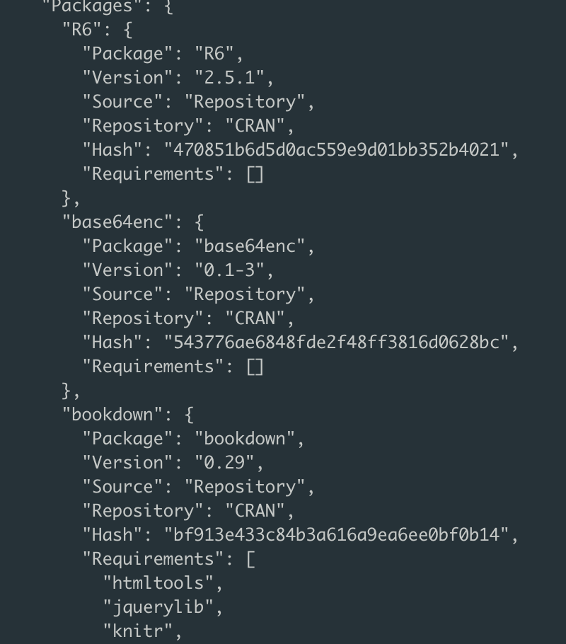

# Environments as Code

**Learning objectives:**

-   List the **three layers of data science environments.**
-   Explain **why** it's important to **control the package
    environment.**
-   **Use `{renv}`** (or `{venv}`) to control the **package
    environment.**
-   Recognize **when** it is important to **control the system
    environment.**

## Recap

The 5 tenets of DevOps from the intro call:

1.  Code should be **well-tested** and tests should be **automated.**
2.  **Updates** should be **frequent** and **low-risk.**
3.  **Security** concerns should be considered **up front as part of
    architecture.**
4.  **Production** systems should have **monitoring and logging.**
5.  Frequent opportunities for **review, change, and updating** should
    be **built into the system** -- both **culturally** and
    **technically.**

Chapter 1

1.  Development
2.  Testing
3.  Production

`r-lib` and Github Actions

"Servers as cattle"

## Intro Discussion

Before we dive in, who has experience with managing package environments
in R and Python, and what do you guys think about each language's
ecosystem?

Which is simpler/more pleasant to use?

Have you tried in R without RStudio?

## The Three Layers of Environments

- Packages
- System
- Hardware

Today we will focus mainly on the first layer, the package environment.

## The Package Environment


## Please don't

::: {style="display: grid; grid-template-columns: 1fr 1fr; grid-column-gap: 10px;"}
<div>

```{r, eval = FALSE}
# Check if dplyr installed
if (!"dplyr" %in% row.names(installed.packages())) {
  # install if not
  install.packages("dplyr")
}
```

</div>

<div>


</div>
:::

Why not?

"This works fine for a while. But the problem with this is that the default has you installing things into a cache that’s shared among every project on your system."

It's also considered rude to make changes to a user's system-level package setup.

More importantly, DevOps aims to help you make things that don't break,
installing packages without versions specified does not prevent things
from breaking in the future.

## The Rooms of a House

Most of us manage to fit everything we want in our homes, but it's not
all in the same room and we're not bound to keep our rooms the same over
time.

At any given time, we put things in different rooms for a variety of
reasons; space and incompatible functions being the main two.

This is also true over time - perhaps even more so - we move rooms
around, place things in and out of rooms according to our needs. It
would be quite restrictive if we had to have everything, everywhere, all
at once.

## There Can Only Be One

It would be more restrictive still, if we had to have incompatible
things together. Kitchen and toilet together? No thanks


## Why?

'Why can't we have multiple version of the same package?'


When it comes to managing package environments, each package is stored
in a /Library folder and we can only have one version of each package in
/Library

## Virtual Environments to the Rescue

We can't have multiple versions of 'package x' in /Library, but we can have multiple versions of /Library, each with a different version of 'package x'

::: {style="display: grid; grid-template-columns: 1fr 1fr; grid-column-gap: 10px;"}
<div>


</div>

<div>


</div>
:::

## Using Renv

-   Create a project
-   Call `renv::init()` to create a standalone library
-   Call `renv::activate()` this happens automatically if using RStudio
    projects
-   Install necessary packages with traditional syntax
    `install.packages("dplyr")`
-   Call `renv::snapshot()` to track versions etc.

"\* Lockfile written to '\~/git_repos/bookclub-do4ds/renv.lock'."

Now you have a file called renv.lock which has been updated with the project's packages and their versions:



*see book for python equivalent i.e. virtualenv/venv and requirements.txt

##  Sharing The Environment

Now that you have your lock file, you can send your project over to a friend/colleague and they should:

- Download the project
- Move into the project directory through the cmd line in 2 ways:
  1 Open the .RProj file with RStudio
  2`setwd('<project-dir>')` e.g. if you made a projects folder in your home directory and a project within your projects folder named my_project: `setwd("~/projects/my_project")`
- `renv::init()`
- `renv::restore()` - if this didn't happen automatically
 
## Avoiding Conda in production


"In the context of a production environment, Conda smashes together the language version, the package management, and (sometimes) the system library management. ... I generally recommend people use a tool that’s just for package management, like {venv}, as opposed to an all-in-one tool like Conda."

## Taking Control of the System Environment

"In other cases, your R or Python library might basically just be a wrapper for system libraries. For example, many popular packages for geospatial analysis are just thin language wrappers that call out to the system libraries. In this case, it might be important to be able to maintain a particular version of the underlying system library to ensure that your code runs at all in the future."

As we have a chapter dedicated to Docker (which I haven't read) I won't dive into this here - I expect we'll have run out of time too.

## Further reading

https://rstats.wtf/


## Review

I'm leaving this slide as a discussion and will edit retroactively, so... What did we learn?

| Learning Objective                                                        | What Did We Learn?                                    |
|-----------------------------------------|-------------------------------|
| List the **three layers of data science environments.**                   | |
| Explain **why** it's important to **control the package environment.**    |  |
| **Use `{renv}`** (or `{venv}`) to control the **package environment.**    |  |
| Recognize **when** it is important to **control the system environment.** |  |

## Meeting Videos

### Cohort 1

`r knitr::include_url("https://www.youtube.com/embed/b2GWwkN8rR8")`

<details>

<summary>

Meeting chat log

</summary>
```
00:43:56	Tinashe Tapera:	https://www.tidyverse.org/blog/2017/12/workflow-vs-script/
00:45:19	Jon Harmon (jonthegeek):	That blog led to one of my favorite hex stickers: "Everything I Know Is From Jenny Bryan" https://raw.githubusercontent.com/MonkmanMH/EIKIFJB/main/EIKIFJB_sigmar_hex.png
```
</details>
