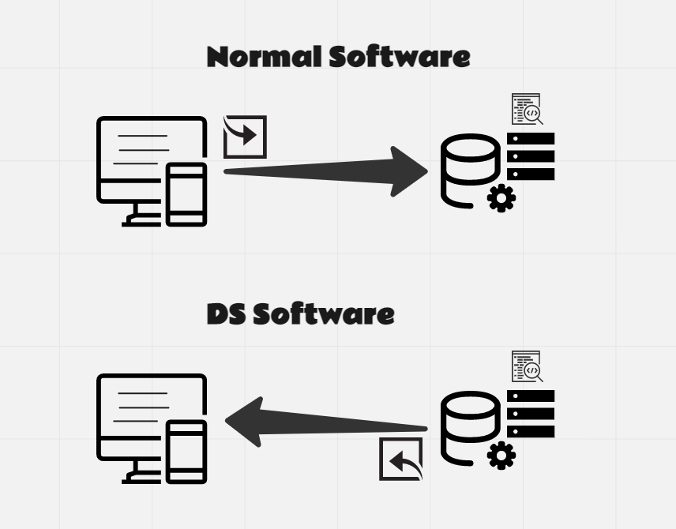

# Designing Your Application Layers

> Since these notes were prepared, this chapter has been split into two chapters. These notes have not been updated to reflect this change.

**Learning objectives:**

-   Compare and contrast the tiers of the three-tier app architecture vs the seven data science services.
-   Answer the two data-storage questions about an app: storage format and storage location.
-   Choose the appropriate storage solution for an app.
-   Authorize an app to access data.
-   Consider database-as-a-service options.

## Perspectives on Data Science Projects {-}

-   DS vs SE Perspective

    -   Data Flow Differences

        

    -   The software three-tier architecture vs the seven data science layers.

-   We as SE/DE think of systems as a puzzle pieces where each piece of the puzzle have to optimally fit/integrated with other puzzle pieces.

## Productionizing apps {-}

-   Microservices and tight coupling (SRP OR SOC)

-   The Idea of abstraction in software engineering & It's relation to how we could create a good API.

-   **Important distinction**: Business Logic Vs App Logic

    -   App Logic --\> is all about how the user interacts with the app

    -   Business Logic --\>is all about the data inputs based on your business

-   What else comes to your mind when you move DS project to production?

## The What & Where Questions of Storage {-}

-   What format would you use to store your data and why?

-   Where you gonna put your data?

## Factors we should consider when we choose our storage solution {-}

-   Data Access patterns

    -   on The App level

    -   on The Data Pipeline Level

-   Data Security

-   How big are the data we're going to use inside our app?

    

-   What are the performance criteria for the storage solution?

    -   Throughput --\> how many units of information can be processed by a system within a given timeframe.

    -   Latency --\> is the time it takes for data to pass from one point on a network to another.

## Data authorization {-}

-   Don't allow all users to have access to all data.

-   Avoid ever putting credentials in plain-text.

-   Trivial approach of using `Sys` or `os` in R and Python.

-   RStudio Connect to the Rescue with an encryption option.

## Database-as-a-service {-}

-   When to use what? **Database** vs **Datawarehouse** vs **Datalake**.

-   Recommended solutions: **EBS**, **RDS**, **Redshift** and **S3**.

-   Is that all we got? (**Hint**: Not even close!!).

## Review {-}

Left those as an open discussion questions?

| Learning Objective                                                                                    | What Did We Learn? |
|------------------------------------|------------------------------------|
| Compare and contrast the tiers of the three-tier app architecture vs the seven data science services. |                    |
| Answer the two data-storage questions about an app: storage format and storage location.              |                    |
| Choose the appropriate storage solution for an app.                                                   |                    |
| Authorize an app to access data.                                                                      |                    |
| Consider database-as-a-service options.                                                               |                    |

## Meeting Videos {-}

### Cohort 1 {-}

`r knitr::include_url("https://www.youtube.com/embed/Dh1g_D_Ir0A")`

<details>

<summary>Meeting chat log</summary>
```
00:02:43	Gus Lipkin:	East Coast US, 1pm local
00:44:48	Gus Lipkin:	https://xkcd.com/927/
00:57:17	Jack Penzer:	Graph databases <3
```
</details>
