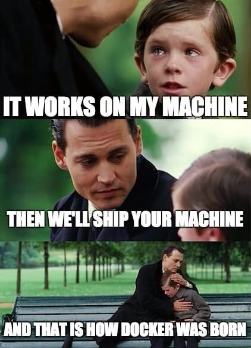

# Docker for Data Science

**Learning objectives:**

-   Decide whether a container is the right tool for a given job.
-   Download and run pre-built Docker images.
-   Describe the stages of the Docker container lifecycle.
-   Build simple Dockerfiles for your own projects.

## Why containers?



- Containers are a way to save an entire machine's state, rather than just project components
  - This extends beyond packages and libraries to the R or Python version itself, as well as any other tools
  
- While a container is similar to a VM, they are much more single purpose. They...
  - are quick to start
  - can be used for individual projects or scripts
  
- The container's configuration is code (infrastructure as code!) and so it's easy to reproduce

*https://www.reddit.com/r/ProgrammerHumor/comments/cw58z7/it_works_on_my_machine/*

## Why containers for Data Science?

- Containers are mostly used for:
  1. Packaging an environment for someone else to use
  2. Packaging a finished product (project/app/whatever) for archiving, reproducibility, or production
  

  
Potential examples:

- When publishing, instead of providing code, data, and describing the environment used, you can include a Dockerfile so anyone can pick up exactly where you left off
- You have a project at work that needs to be interacted with every week no matter who looks at it or when
- You're publishing an R package and want to test specific features across different base R or package versions

## Words of caution

- Docker is limited to the resources you give it. If your dev machine is less than awesome, your Docker container will be much less than awesome
- Docker is only allowed access to what you give it and may take some extra work to get running
- Some workplaces may not be comfortable with Docker
- Some use-cases may require direct access to the hardware and are incompatible with a container system
  - Sometimes computers do math differently
  
- Containers require proper setup!

## Diving In

### Docker Run

`docker run [OPTIONS] IMAGE [COMMAND] [ARG...]`

- `docker run` tells Docker to run the following image
- Options are configured as needed
- `IMAGE` is configured as `user/image` when pulling from docker hub (like CRAN but for Docker)

```{bash, eval=FALSE}
docker run --rm -d \
  -p 8000:8000 \
  --name palmer-plumber \
  alexkgold/plumber
```

### Docker Compose

`docker-compose.yml` -> `docker compose [-f <arg>...] [options] [COMMAND] [ARGS...]`

- The `docker-compose` file provides a structured way to describe a docker image
- Easy way to combine multiple services (maybe you want R + Python)
- Can be used with the `run` (do something) or `up` command (be ready to do something)
- Options are similar to `docker run`

```{yml, eval=FALSE}
version: '3.3'
services:
    plumber:
        ports:
            - '8000:8000'
        container_name: palmer-plumber
        image: alexkgold/plumber
```

```{bash, eval=FALSE}
cd project-dir
docker-compose up
```

## Container Lifecyle


- Change the Dockerfile, not the image
- Images can be shared like code
  - Think Git!
- There are services to provide private image registries for companies
- Containers usually auto-pull if it doesn't exist already

## More on Docker Run

```{bash, eval=FALSE}
docker run --rm -d \
  -p 8000:8000 \
  --name palmer-plumber \
  alexkgold/plumber
```

- DockerHub containers are in the form `<user>/<name>` (`alexkgold/plumber`)
  - You can tag an image with a version number `user>/<name>:<version>`

- `--rm` to remove the container on kill (probably not for production)
- `-d` run in detached mode so the terminal is free for other uses
- `-p <host>:<container>` publishes a port from inside the container to outside
- `--name` to assign a name of your choice
- `-v <outside/directory>:<inside/directory>` to expose a directory
  - `${PWD}` is your project directory
  
## Build a Dockerfile

- Not the same as a `docker-compose.yml`

- `FROM` the base image for the container
- `RUN` run any command as though it's using the terminal
  - If using something fancy, you may need to install it first
- `COPY` copy a file from host to container
- `CMD` run a command at runtime


- Containers will rebuild from the top-most command that was changed

```{bash, eval=FALSE}
# syntax=docker/dockerfile:1
FROM ubuntu:20.04

# Copy external files
RUN mkdir -p /project/out/

COPY ./requirements.txt /project/
COPY ./hello.ipynb /project/

# Install system packages
RUN apt-get update && apt-get install -y \
  wget python3 python3-pip

# Install quarto CLI + clean up
RUN wget https://github.com/quarto-dev/quarto-cli/releases/download/v0.9.83/quarto-0.9.83-linux-amd64.deb
RUN dpkg -i ./quarto-0.9.83-linux-amd64.deb
RUN rm -f ./quarto-0.9.83-linux-amd64.deb

# Install Python requirements
RUN pip3 install -r /project/requirements.txt

# Render notebook
CMD cd /project && \
  quarto render ./hello.ipynb && \
  # Move output to correct directory
  # Needed because quarto requires relative paths in --output-dir: 
  # https://github.com/quarto-dev/quarto-cli/issues/362
  rm -rf /project-out/hello_files/ && \
  mkdir -p /project-out/hello_files && \
  mv ./hello_files/* /project-out/hello_files/ && \
  mv ./hello.html /project-out/
```

```{bash, eval=FALSE}
docker build -t <image name>
```

## Trying out Docker

1. Try out plumber penguins [in your browser]( http://localhost:8000/__docs__/)

```{bash, eval=FALSE}
docker run --rm -d \
  -p 8000:8000 \
  --name palmer-plumber \
  alexkgold/plumber
```

2. Kill it

```{bash, eval=FALSE}
docker kill palmer-plumber
```

3. Do it again

```{bash, eval=FALSE}
docker run --rm -d \
  -p 8000:8000 \
  --name palmer-plumber \
  alexkgold/plumber
```

4. Poke around

```{bash, eval=FALSE}
docker exec -it palmer-plumber /bin/bash
cat api/plumber.R
exit
```

5. Kill it again

```{bash, eval=FALSE}
docker kill palmer-plumber
```

## Meeting Videos

### Cohort 1

`r knitr::include_url("https://www.youtube.com/embed/gzJ3eT6tcog")`

`r knitr::include_url("https://www.youtube.com/embed/CHbaTCo4gQk")`
