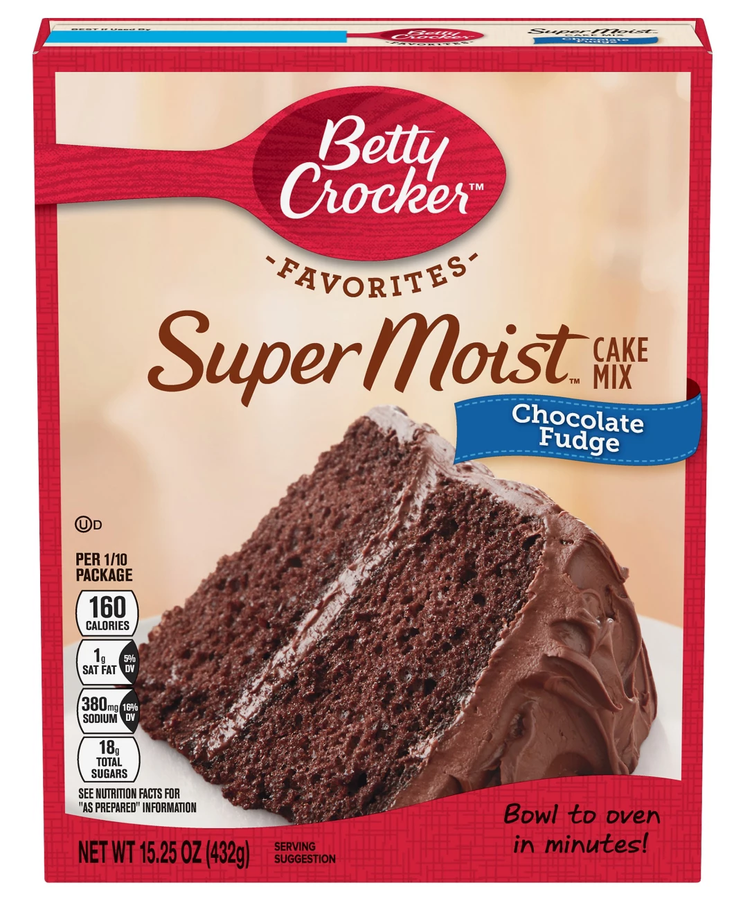

# Getting Started with the Cloud

**Learning objectives:**

-   Recognize **why** you might (and might not) want to **host services in the cloud.**
-   Differentiate between **IaaS, PaaS,** and **SaaS.**
-   List some **common cloud services.**
-   Start and stop and **EC2 instance** on AWS.

## Quick Section Overview

> So this section is really targeting the student who wants to **host a project for portfolio purposes,** the hobbyist who's **hosting a toy project,** or the data science leader who **has no choice but to host things for themselves because they just can't get IT/Admin support.**

🎉🎉🎉 I've been two of those things in the last year!

## Why cloud?

-   It probably isn't cheaper.
-   It's faster and easier.
    -   No need to wait for new hardware to arrive and be installed.

## Things as a Service

::: {style="display: flex;"}
<div>

**Infrastructure as a Service (IaaS, "eye-az")** {width="400"}

</div>

<div>

**Platform as a Service (PaaS, "pass")** {width="400"}

</div>

<div>

**Software as a Service (SaaS, "sass")** {width="400"}

</div>
:::

## Common Cloud Services

| Service                  | AWS                              | Azure                          | GCP                            |
|------------------|-------------------|------------------|------------------|
| Kubernetes cluster       | EKS (Elastic Kubernetes Service) | AKS (Azure Kubernetes Service) | GKE (Google Kubernetes Engine) |
| Run a function as an API | Lambda                           | Azure Functions                | Google Cloud Functions         |
| Database                 | RDS/Redshift                     | Azure Database                 | Google Cloud SQL               |
| ML Platform              | SageMaker                        | Azure ML                       | Vertex AI                      |

## Discuss the Lab

<https://aws.amazon.com>

## Meeting Videos

### Cohort 1

`r knitr::include_url("https://www.youtube.com/embed/URL")`

<details>
<summary>Meeting chat log</summary>
```
LOG
```
</details>
