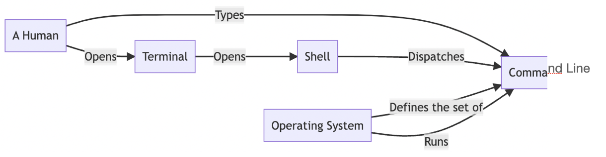

# The Terminal

**Learning objectives:**

- Gain a basic awareness of the terminal
- Understand the 3 programs which sit on top of the command line
- Familiarize ourselves with customizing the terminal/shell

## The Three Programs

We have three programs which sit on top of one another:

-   The terminal - we type commands
-   The shell- matches typed commands to programs
-   The operating system - runs the commands 




## Why should you learn to use the terminal?


Because you want to be this guy.

*Let's discuss this and fill in some reasons?

## Selecting your terminal

As a Mac user Alex recommends using the built-in app, Terminal, so do I!

iTerm 2 for multiple tabs, theming and other niceties. Has anyone used this, anything to add?

Same for Windows! 

Any thoughts here, disagreements, recommendations?

## Selecting your shell

Mac users: 

Alex recommends  zsh, notes that the defualt shell - Bash is fine too.

Shoutouts for zsh, Ksh, and Fish.

Plugin managers: OhMyZsh and Prezt

Windows users:

PowerShell > Cmd


## Meeting Videos {-}

### Cohort 1 {-}

`r knitr::include_url("https://www.youtube.com/embed/URL")`

<details>
<summary> Meeting chat log </summary>

```
LOG
```
</details>
