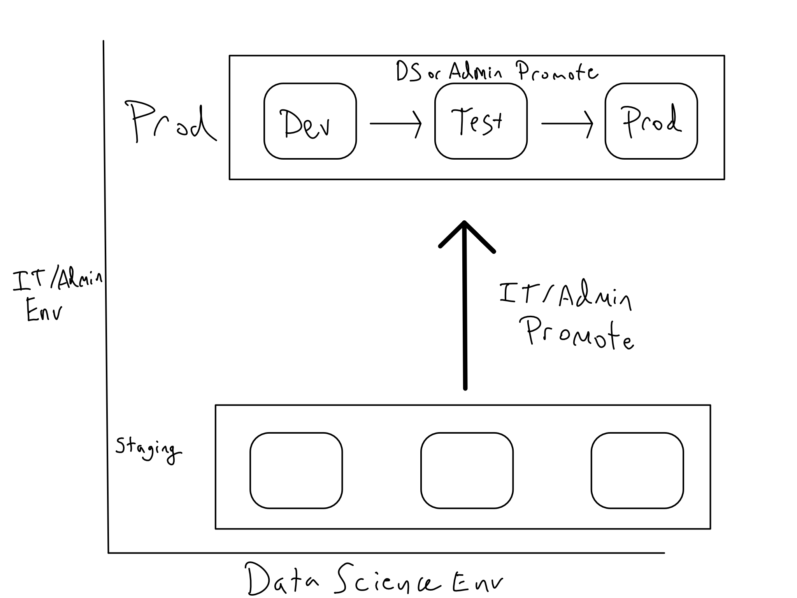
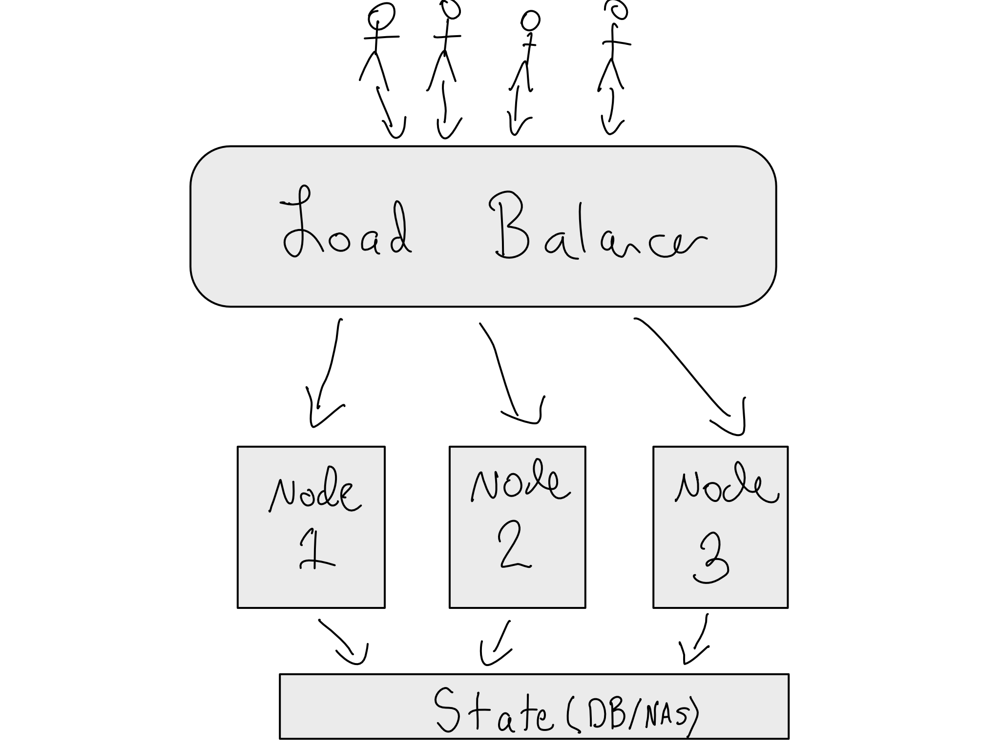

# Enterprise Server Management

**Learning objectives:**

-   Simplyfing Complexity Using Infrastructure as Code (IaC)
-   How to Scale and Stabilize Workloads in Enterprise-Level Organisations
-   Facilitating Enterprise Workloads Management with Kubernetes

## Simplyfing Complexity Using Infrastructure as Code (IaC)

-   Servers should be cattle, not pets.

-   Alex recommended a two-dimensional Dev/Test/Prod setup

    

    -   IT/Admin group make changes to the platform in a staging environment.

    -   Data scientists are never granted access to the staging environments and must complete all of their work in the IT/Admin production environment.

- The ideal approach to migrate servers and apps from staging to production is to use IaC and CI/CD to ensure that code changes always make it into production at the proper time.

## How to Scale and Stabilize Workloads in Enterprise-Level Organisations

-   Vertical Scaling Limitations and Horizontal Scaling to the rescue

    -   Before attempting horizontal scaling, it is usually always good to exhaust the portion of vertical scaling where costs climb linearly with computation.

-   High Availability is achieved by

    -   Using Load balancers in Horizontal scaling

        -   Imagine a restaurant with one chef that is trying to serve meals to a hundred customers at once.

            -   The chef can only cook one meal at a time, so the customers are getting frustrated with long wait times and some of them are leaving.This is because the chef is overloaded and cannot handle the intense workload.

            -   Now, imagine the restaurant hires three more chefs, all with the same skills and equipment as the first chef. The restaurant invests in a system where each chef has a buzzer that goes off when there are new orders waiting for them. The buzzer ensures that each chef knows exactly when they need to start cooking a new meal, and they do not get overwhelmed by too many orders at once.

            -   In this analogy, the chefs represent servers or clusters, and the buzzer represents a load balancer.

    -   Maintaining a backup of the load balancer and the database/NAS.

-   Adding Autoscaling (i.e. you save money when traffic is low)
    -   Many autoscaling frameworks these days assume that applications are mostly stateless.

## Facilitating Enterprise Workloads Management with Kubernetes

-   Kubernetes solves all three of the key enterprise IT/Admin challenges with running servers.

-   Increasing the processing power of your cluster is usually as simple as a few mouse clicks. On the other side, this makes it risky from a cost perspective.

-   *Helm* is the standard tool for defining what's running in the cluster.

-   Instead of the ten steps required in a typical server-based deployment. There are just three steps for Kubernetes.

-   What are the biggest strengths of Kubernetes as a scaling tool? What are some drawbacks?

    -   Strengths:

        -   Automatic Load Balancing

        -   Horizontal Scaling

        -   Infrastructure Agnosticism

    -   Drawbacks:

        -   Managing and maintaining a Kubernetes cluster can be complex and time-consuming and really requires a highly competent Kubernetes admin

        -   Networking in Kubernetes can also be quite complicated.

## Meeting Videos {.unnumbered}

### Cohort 1 {.unnumbered}

`r knitr::include_url("https://www.youtube.com/embed/URL")`

Meeting chat log

    LOG

