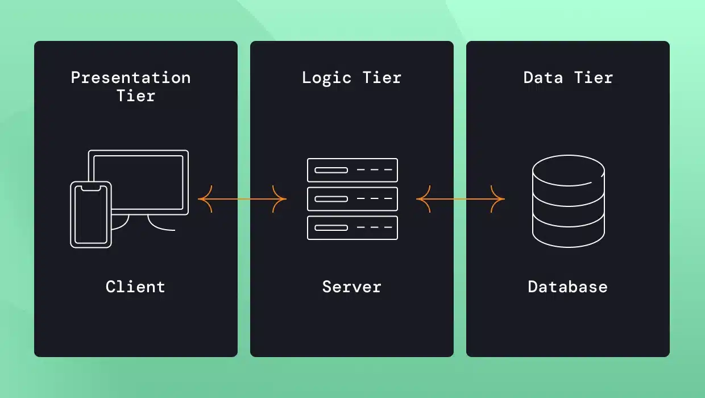

## Learning objectives


- Learn about the three-layer app.
- Learn why the presentation layer is important and how can we handle its data.
- Learn about APIs.

## The three layer architecture
Poorly-architected software is likely to break when you share it or go to production.
A standard software arquitechture for apps:



## Is it for Data Science projects?

The three layers can help clarify parts of our projects, but:

- We might not be designing an app
- We usually have projects with many components
- Apps run in response to user actions, data science projects run in response 
to updates to the data
- We usually don't have ownership on the data

## The presentation layer

It is what our users will consume, so we have to choose it first. Options:

- A **job**: it changes something in another system. 
- An **app**: data science web apps to explore datasets.
- A **report**: might be static or have some interactive elements.
- An **API**: for machine-to-machine communication. 

##


## Other things to consider for the presentation layer

- **Do less** here. Keep only code that shows something to the user or that collects input from the user
- Have **small data** here, you want high performance. 
    - Can you precalculate anything before it goes to the presentation layer?
    - Can you reduce the granularity of your data? Figure out the dimensions that will make sense to the user

## How to make big data small

Don't pull all the data into your session. Instead:

- Push work to the **data source**: do anything you can do before you pull the data out.
- Be **lazy** with data pulls: pull the data that's needed when it's needed.
- **Sample** the data. Makes sense for machine learning tasks but not for counting. 
- **Chunk and pull**. Identify natural groups. 

## Where to store the data

It depends on how often it is **updated**. In the presentation bundle, only if the data and the app will 
be updated together. 

- Filesystem: hard for deployment.
- Blob storage or pins: cloud storage like S3 from Amazon, Google Storeage or Azure.
 They usually have packages.
 - Google sheets: maybe as an intermediate step. 

You can also store your intermediate artifacts in `.csv`, `pickle` or `rds` files or use **DuckDB**.

## How about an API?

::::{.columns}
:::{.column width="50%"}
- API: Application Programming Interface. 
- Suited for the middle tier, you separate the processing logic into functions.
- **Function as a service**. Functions, but in a completely separate process. 
- `{fastAPI}` and `{plumber}` can help.
:::
:::{.column width="50%" .center}

:::
::::

## REST APIs

- REpresentational State Transfer:
- Resources and URLs to identify each function.
- HTTP methods for CRUD operations. 
- Stateless: no client-specific context.
- Representations for requests and reponses: Json or XML.

[Dataverse Access API](https://guides.dataverse.org/en/6.7/api/dataaccess.html)

## Write a data flow chart


## Review {-}

Comprehension questions

- Do you ever think about your application layer?
- What libraries could you use to implement a three-layer architecture in R or Python?
- How do you reduce the data requirements for your project?
- How do you handle your intermediate artifacts?  

## Meeting Videos {-}

### Cohort 1 {-}

`r knitr::include_url("https://www.youtube.com/embed/Dh1g_D_Ir0A")`

<details>

<summary>Meeting chat log</summary>
```
00:02:43	Gus Lipkin:	East Coast US, 1pm local
00:44:48	Gus Lipkin:	https://xkcd.com/927/
00:57:17	Jack Penzer:	Graph databases <3
```
</details>
